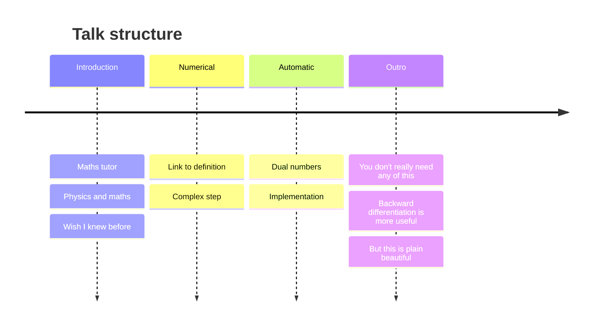

<!-- slide bg="https://github.com/PabRod/autodiff-slides/blob/main/_meta/_img/escience-cover.png?raw=true" -->
# Automatic differentiation
## A peek under the hood

By Pablo Rodríguez-Sánchez

note: this will be invisible in the slide
### Mind map


---
## Before we start

[pabrod.github.io](pabrod.github.io)

---
## Remember derivatives?


--

A derivative takes a function $f$ and a position $x_0$ as an argument, and returns a number representing the slope of that function at that point.

+ $(f, x_0) \rightarrow f'(x_0)$

--

$$
f'(x_0) \equiv \lim_{\epsilon \to 0} \frac{f(x_0 + \epsilon) - f(x_0)}{\epsilon}
$$

--

## Numerical derivative
$$
f'(x_0) \equiv \lim_{\epsilon \to 0} \frac{f(x_0 + \epsilon) - f(x_0)}{\epsilon}
$$

$$
f'(x_0) \approx \frac{f(x_0 + \epsilon) - f(x_0)}{\epsilon}
$$
--
## Fun fact

$$
f'(x_0) \equiv \lim_{\epsilon \to 0} \frac{1}{\epsilon }\Im f(x_0 + i \epsilon)
$$
--
## Fun fact
$$
f'(x_0) \approx \frac{1}{\epsilon }\Im f(x_0 + i \epsilon) + O(\epsilon^2)
$$

---
### Wait, I don't remember any of this


### Print local file


--
$$
f'(x_0) \equiv \lim_{\epsilon \to 0} \frac{f(x_0 + \epsilon) - f(x_0)}{\epsilon}
$$
--
+ $\frac{d}{dx} x^{3} = 3 x^2$
+ $\frac{d}{dx} \sin x = \cos x$
+ $\frac{d}{dx} (x^{3} + \sin x) = \frac{d}{dx} x^{3} + \frac{d}{dx} \sin x$
--


--
- Linearity
	+ $(f(x) + g(x))' = f'(x) + g'(x)$
	+ $(f(x) - g(x))' = f'(x) - g'(x)$
	+ $(c \cdot f(x))' = c \cdot f'(x)$
--
- Product rule
	+ ($f(x)\cdot g(x))' = f'g + g'f$ 
+ Quotient rule
	+ ($\frac{f(x)}{g(x)})' = \frac{f'g - g'f}{g^2}$ 
--
- Chain rule
	+ $(f(g(x)))' = f'(g) \cdot g'(x)$
	+ $\frac{df}{dx} = \frac{df}{dg} \frac{dg}{dx}$
	+ $\frac{df}{dx} = \frac{df}{da} \frac{da}{db} \frac{db}{dc} \dots \frac{dy}{dz} \frac{dz}{dx}$
---
## Can we teach derivatives to a computer
+ Just as we'll do with a human student?

--
## Dual numbers

$$
z = (f, f')
$$

Where:
+ $f$  represents a function
+ $f'$ represents its derivative
+ Both of them evaluated at a given point

--
# Addition
$$
(f, f') + (g, g') = (f + g, f' + g')
$$
--
# Subtraction
$$
(f, f') - (g, g') = (f - g, f' - g')
$$
--
# Multiplication
$$
(f, f') \cdot (g, g') = (fg, f'g + fg')
$$
--
#  Division
$$
\frac{(f, f')}{(g, g')} = (\frac{f}{g}, \frac{f'g - fg'}{g^2})
$$
--
# Powers
$$
(f, f')^{n} = (f^n, nf^{n-1} \cdot f')
$$

--
# Nice trick
## But how is this useful?

--
# Consider this
$$
f((x, 1)) = (f(x), f'(x))
$$

Is true for ==**any**== algebraic function!

--
# What about non-algebraic?
$$
\sin((u, u')) = (\sin u, \cos u \cdot u')
$$

---
# How to implement
```julia
""" Structure representing a Dual number """
struct Dual
    x::Real
    dx::Real
end
```

--
# Addition
$$
(f, f') + (g, g') = (f + g, f' + g')
$$
```julia
function +(self::Dual, other::Dual)::Dual
    return Dual(self.x + other.x, self.dx + other.dx)
end
```

--
# Multiplication
$$
(f, f') \cdot (g, g') = (fg, f'g + fg')
$$

```julia
function *(self::Dual, other::Dual)::Dual
    y = self.x * other.x
    dy = self.dx * other.x + self.x * other.dx
    return Dual(y, dy)
end
```

--
# Division

$$
\frac{(f, f')}{(g, g')} = (\frac{f}{g}, \frac{f'g - fg'}{g^2})
$$
```julia
function /(self::Dual, other::Dual)::Dual
    y = self.x / other.x
    dy = (self.dx * other.x - self.x * other.dx) / (other.x)^(2)
    return Dual(y, dy)
end
```

--
## Teach also the basics
$+(f, f') = (f, f')$
```julia
+(z::Dual) = z
```

$-(f, f') = (-f, -f')$
```julia
-(z::Dual) = Dual(-z.x, -z.dx)
```

--
## Teach also the basics

$(f, f') > (g, g') \iff f > g$
```julia
>(self::Dual, other::Dual) = self.x > other.x
```
--
## Teach also the basics
$(f, f') \equiv (g, g') \iff f \equiv g, f' \equiv g'$
```julia
==(self::Dual, other::Dual) = (self.x == other.x) && (self.dx == other.dx)
```

--

## Example

```julia
poly = x -> x^(3) + x^(2) + x  
z = Dual(3, 1)  
poly(z)  
  
> Dual(39, 34)
```

--

## Example

```julia
""" Equivalent to previous example. Just uglier """  
function poly(x)  
	aux = 0 # Initialize auxiliary variable  
	for n in 1:3  
		aux = aux + x^n  
	end  
end  
  
poly(z)  
  
> Dual(39, 34)
```

--

## Table of derivatives

```julia
'''Enables one-liners like:

operator(z::Dual) = _factory(<fun>, <derivative>)(z)

'''
function _factory(f::Function, df::Function)::Function
    return z -> Dual(f(z.x), df(z.x) * z.dx)
end
```

--
## Table of derivatives
$\frac{d}{dx} \sin x = \cos x$
```julia
sin(x::Dual) = _factory(sin, cos)(x)
```
--
## Table of derivatives
$\frac{d}{dx} \cos x = -\sin x$
```julia
sin(x::Dual) = _factory(sin, cos)(x)
cos(x::Dual) = _factory(cos, x -> -sin(x))(x)
```
--
## Table of derivatives
$\frac{d}{dx} \tan x = ?$
```julia
sin(x::Dual) = _factory(sin, cos)(x)
cos(x::Dual) = _factory(cos, x -> -sin(x))(x)
tan(x::Dual) = sin(x) / cos(x)
```

--
## Table of derivatives
```julia
csc(x::Dual) = 1 / sin(x)
sec(x::Dual) = 1 / cos(x)
cot(x::Dual) = 1 / tan(x)
```

Found typo: the code above requires coercing `Real` into `Dual` at quotient definition. 
See code [here](https://github.com/PabRod/DualDiff.jl/blob/main/src/Dual.jl#L59). 
I hid this in the slides for the sake of simplicity. 

Kudos for [Suvayu Ali](https://www.esciencecenter.nl/team/suvayu-ali/) for noticing.

--
## Example

```julia
fun = x -> x + tan(cos(x)^(2) + sin(x)^(2))  
  
z = Dual(0, 1)  
fun(z)  
  
> Dual(1.557407724654902, 1.0)
```
---

# Is this necessary?

--
## Materials available at

[pabrod.github.io](pabrod.github.io)

+ Including:
	+ Link to these slides
	+ Code examples in Python and Julia
	+ Links to packages that do this for you
	+ Links to better materials than mine

--
# Thanks for your attention